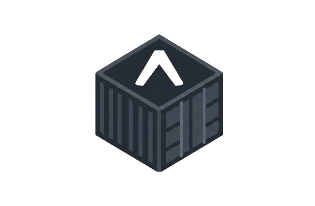

<p align="center">
  <picture>
    <source media="(prefers-color-scheme: dark)" srcset="docs/assets/ebl_logo-dark.png">
    
  </picture>
</p>

<h1 align="center">expo-builder-local</h1>
<p align="center"><em>ebl</em> &mdash; build a managed Expo project into a signed Android APK/AAB entirely on your own machine.</p>

<p align="center">
  <a href="https://github.com/41vi4p/expo-builder-local/releases/latest"></a>
  <a href="https://github.com/41vi4p/expo-builder-local/actions/workflows/ci.yml"></a>
  <a href="./LICENSE"></a>
  
  <a href="https://github.com/41vi4p/expo-builder-local/issues"></a>
</p>

Build a managed Expo (SDK 56+) project into an Android APK/AAB entirely on your own
machine — from the command line or a web GUI — in a disposable Docker container, and
get a properly-signed artifact exported straight into that project's `ebl_builds/`
folder, versioned per build.

No Expo account is required for the default path — everything runs in a disposable
Docker container with its own Android SDK, Node and Gradle. If you'd rather use EAS's
remote-managed credentials, that's supported too (see [Build engines](#build-engines)).

## Contents

- [Quick start](#quick-start-cli)
- [Uninstall](#uninstall)
- [Why this exists](#why-this-exists)
- [Architecture](#architecture)
- [Command reference](#command-reference)
- [Using the GUI](#using-the-gui)
- [Build engines](#build-engines)
- [Multiple Expo accounts](#multiple-expo-accounts)
- [Signing](#signing)
- [Docker Hub images](#docker-hub-images)
- [APT repository](#apt-repository)
- [Local development](#local-development-contributing-to-this-repo)
- [Path handling](#path-handling-important)
- [Security notes](#security-notes)
- [Troubleshooting](#troubleshooting)

## Quick start (CLI)

> **Recommended: 16GB+ RAM, ~40GB free disk.** A cold build compiles native code for
> 4 CPU architectures (arm64-v8a/armeabi-v7a/x86/x86_64) plus the Kotlin/JS toolchain —
> genuinely resource-heavy. Less RAM can still work, but is more likely to fail under
> load; on Windows specifically, Docker Desktop's WSL2 VM running out of memory
> crashes its own Engine API rather than just slowing the build down (see the Windows
> section below for how `ebl` handles that automatically). The ~40GB of disk covers
> the runner image, Gradle/npm build caches, and (on Windows) WSL2 swap headroom —
> reclaim all of it any time with `ebl clean --all` (see
> [Command reference](#command-reference)).

### Linux (Ubuntu/Debian)

**Via the APT repository (recommended)** — `sudo apt upgrade` picks up new releases automatically:

```bash
curl -fsSL https://41vi4p.github.io/expo-builder-local/apt/pubkey.gpg | sudo gpg --dearmor -o /usr/share/keyrings/ebl-archive-keyring.gpg
echo "deb [arch=amd64 signed-by=/usr/share/keyrings/ebl-archive-keyring.gpg] https://41vi4p.github.io/expo-builder-local/apt stable main" | sudo tee /etc/apt/sources.list.d/ebl.list
sudo apt update && sudo apt install ebl
```

**Or the one-line installer** (adds the APT repo where possible, otherwise falls back to a direct `.deb` download):

```bash
curl -fsSL https://raw.githubusercontent.com/41vi4p/expo-builder-local/main/install.sh | sh
```

**Or the `.deb` directly** — grab `ebl_*_amd64.deb` from [Releases](https://github.com/41vi4p/expo-builder-local/releases), then:

```bash
sudo apt install ./ebl_*_amd64.deb
```

### Windows

`ebl.exe` is a native Windows build of the same CLI every other platform uses — it
talks directly to Docker Desktop's `\\.\pipe\docker_engine` named pipe (the same
endpoint `docker.exe` itself uses), so `ebl.exe` itself needs no WSL2 distro or
separate Linux install. Docker Desktop's own default backend *is* a WSL2 VM, though,
and that's what actually runs your builds. See [`windows/`](./windows) and
[`cli/`](./cli) for how it's built.

**Setup order:**

1. **WSL2**, if you don't already have it — in an elevated PowerShell or Command
   Prompt:
   ```powershell
   wsl --install
   ```
   then **restart your computer** (required for it to take effect).
2. **[Docker Desktop](https://www.docker.com/products/docker-desktop/)** — install
   and start it.
3. **Run the installer** (below). Neither installer installs WSL2 or Docker Desktop
   for you — both need their own reboot/license handling — but both check for each
   up front and tell you exactly what's missing and how to fix it (the `wsl --install`
   command above, or a direct Docker Desktop download link) rather than failing
   partway through.

**One-line installer** (PowerShell) — checks for WSL2 and Docker Desktop, sizes
WSL2's memory/swap limits from your actual installed RAM (see the requirements note
above — this is what makes that automatic on Windows), downloads and installs
`ebl.exe`, and puts it on your PATH:

```powershell
irm https://raw.githubusercontent.com/41vi4p/expo-builder-local/main/windows/install.ps1 | iex
```

**Or the GUI installer** — download `ebl-setup.exe` from
[Releases](https://github.com/41vi4p/expo-builder-local/releases) and run it; it's a
thin Inno Setup wrapper that bundles the same files and runs the same
`install.ps1` under the hood, so it does exactly the same thing with a familiar
Windows installer UI and an entry in *Add or Remove Programs*.

If disk space gets tight afterward (build caches, the runner image, WSL2's swap
file), reclaim it any time with `ebl clean --all` — see
[Command reference](#command-reference).

### Then

```bash
ebl setup     # checks/installs Docker, pulls the runner/orchestrator/web images
ebl config    # interactive: your projects folder, Expo token, ports
ebl start     # runs the orchestrator + web GUI as containers, prints the GUI link

cd /path/to/your/expo/app
ebl build .              # debug-signed APK, auto engine
ebl build . --prod       # shortcut for --artifact aab --profile production
```

`ebl build` never needs `setup`/`config`/`start` — it works standalone, from anywhere,
against any Expo project, talking to Docker directly. `setup`/`config`/`start` are
only for the optional web GUI (live dashboard, build history, keystore manager).

## Uninstall

> **Run `ebl clean --all` first.** None of the steps below touch Docker — the
> runner/orchestrator/web images, the Gradle/npm cache volumes, and any leftover
> build containers all stay on disk after `ebl` itself is gone. `ebl clean --all`
> (needs Docker Desktop/Docker still running) removes all of that safely in one
> step; afterward you'd have to find and remove it by hand with raw `docker`
> commands instead.

### Linux

If installed via the APT repo or a `.deb`:

```bash
sudo apt remove ebl
# and, if you added it: sudo rm /etc/apt/sources.list.d/ebl.list
```

This removes the `ebl` binary only — your projects, `ebl_builds/` artifacts, and
`~/.config/ebl/` (saved tokens/settings) are untouched. Remove that config directory
yourself if you want a completely clean slate:

```bash
rm -rf ~/.config/ebl
```

### Windows

If you used the **one-line/PowerShell install**, run the uninstaller script it left
behind — this removes `ebl.exe` and its PATH entry:

```powershell
& "$env:LOCALAPPDATA\Programs\ebl\uninstall.ps1"
```

If you used the **`ebl-setup.exe` GUI installer**, uninstall it the normal Windows
way instead — *Settings → Apps → ebl (expo-local-builder) → Uninstall*, or from *Add
or Remove Programs*.

Either way, Docker Desktop itself is left alone — it's your system's own component,
not ebl's, in case anything else on your machine depends on it.

## Why this exists

Expo's managed workflow normally means either `eas build` (cloud, costs money/quota,
needs an Expo account) or manually running `expo prebuild` + Gradle yourself every
time. This tool wraps the second path in a disposable container — driven by a CLI, a
GUI, or both — so any developer can produce a build without setting up an Android SDK
locally or learning Gradle.

## Architecture

```
                 ┌─ ebl build .  (direct, no services needed) ───────────┐
                 │                                                       │
Browser ──HTTP/WS──▶ web (Next.js) ──HTTP/WS──▶ orchestrator (Fastify) ──┴─▶ runner container
   ▲                started by `ebl start`      │ /var/run/docker.sock      (Node + JDK 17 +
   └── ebl setup/config/start drive Docker      ▼                           Android SDK)
       directly — no docker-compose.yml    bind-mounts your project,
       or git checkout required            writes the APK/AAB into
                                            <project>/ebl_builds/
```

- **`cli/`** — the `ebl` command (C++17, CMake): talks to the Docker Engine API
  directly over its unix socket. `ebl build` needs nothing else running; `ebl start`
  launches the orchestrator + web images itself.
- **`expo-builder-gui/`** — the web UI (Next.js): directory browser, build config
  form, live dashboard (progress, logs, CPU/mem/net/disk charts), metrics, history.
- **`orchestrator/`** — a small backend service that spawns and supervises build
  containers via the Docker API, streams their output/stats over WebSocket, and
  persists build history to SQLite.
- **`docker/runner/`** — the Android toolchain image. Not a long-running service: a
  fresh, disposable container is started from it for every single build.

The orchestrator talks to the **host's** Docker daemon over the mounted socket (it is
a sibling container, not a nested one) — see [Path handling](#path-handling-important)
for why that matters.

## Command reference

| Command | What it does |
|---|---|
| `ebl setup` | One-time: checks Docker is installed and running (offers to install it via the official convenience script if not — asks first, needs sudo), then pulls the runner/orchestrator/web images. |
| `ebl config` | Interactive wizard: projects folder (for the GUI's directory browser), a default Expo access token plus optional per-account tokens (see [Multiple Expo accounts](#multiple-expo-accounts) below), orchestrator/web ports. Saved to `~/.config/ebl/config.json`; secrets encrypted at rest (see [Security notes](#security-notes)). Re-run any time to change a value. |
| `ebl start` | Runs the orchestrator + web GUI as Docker containers (pulling images if needed), waits for both to report healthy, prints the GUI URL. No docker-compose.yml or git checkout needed. |
| `ebl stop` | Stops and removes those two containers. Build history/keystores live in a separate volume and are preserved. |
| `ebl build [path] [options]` | Builds an Expo project. Works completely standalone — see below. |
| `ebl clean [--all]` | Removes ebl's own stopped build containers (leftovers from an interrupted/crashed build). With `--all`, also removes the shared Gradle/npm cache volumes and the runner/orchestrator/web images — the next `ebl build`/`ebl setup` just re-pulls/re-creates whatever it needs, so this is safe, just slower on the next run. Refuses `--all` while a build is currently running. |

Run `ebl <command> --help` for the full option list of any command.

### `ebl build`

```bash
ebl build .                    # apk, profile "preview" (or the project's first eas.json profile), engine auto
ebl build . --prod             # --artifact aab --profile production
ebl build . --engine eas --expo-token "$EXPO_TOKEN"
ebl build . --release --keystore ./release.jks --key-alias upload \
  --store-password "$STORE_PW" --key-password "$KEY_PW"
```

Prefer `EXPO_BUILDER_STORE_PASSWORD` / `EXPO_BUILDER_KEY_PASSWORD` / `EXPO_TOKEN`
environment variables over the `--store-password` etc. flags where you can — flag
values are more likely to end up in your shell history. If `ebl config` has already
saved an Expo token, `ebl build` picks it up as a default too (any explicit flag/env
var/`.ebl-token` file still wins).

Every successful build lands in `<project>/ebl_builds/v<app-version>-build<n>/` — `n`
is a simple counter local to that project (see `ebl_builds/.build-counter`), so
"build 4" always means the same thing regardless of how many times a given app
version gets rebuilt. `ebl_builds/` is added to the project's `.gitignore`
automatically on first build.

## Using the GUI

Once `ebl start` is running (or after `make up` — see
[Local development](#local-development-contributing-to-this-repo)):

1. **Pick a project.** The directory browser starts at the projects folder you set
   in `ebl config`; navigate into your Expo app's folder. A green "Expo project
   detected" badge means it found a `package.json` with an `expo` dependency — click
   **Use this folder**.
2. **Configure the build.**
   - **Artifact**: APK (installs directly on a device) or AAB (Play Store bundle).
   - **Profile**: pulled from the project's `eas.json` build profiles if present
     (typically `preview`/`production`), otherwise free text.
   - **Engine**: see [Build engines](#build-engines) below.
   - **Signing**: Debug (fast, installable, not for the Play Store) or Release (upload
     a keystore — see [Signing](#signing)).
3. **Watch it build.** The phase rail shows setup → install → prebuild/EAS → signing →
   compile → collect, each with elapsed time, a live percentage + ETA, streamed logs,
   and CPU/memory/network/disk charts for the build container.
4. **Get your artifact.** On success, the metrics panel shows the build number, size
   (with the delta vs your last build of this app+profile), build time, version,
   application ID, a SHA-256, and the exact path under `ebl_builds/` — plus a download
   button.

Note: builds started from the CLI and from the GUI are intentionally independent —
CLI builds aren't recorded in the GUI's history. Use the GUI when you want the live
dashboard and a persistent history; use the CLI for quick one-offs or CI.

## Build engines

| Engine | How | Needs an Expo account? |
|---|---|---|
| **Gradle (local)** | `expo prebuild` generates the native `android/` project, then Gradle compiles it directly in the container. | No — fully offline once dependencies are cached. |
| **EAS (local)** | `eas build --local` — same command EAS's own cloud workers run, just on your machine. Uses your project's `eas.json` profile as-is. | Yes — needs an [Expo access token](https://expo.dev/accounts/[account]/settings/access-tokens) (set via `ebl config`, `EXPO_TOKEN`, or per-build). |
| **Auto** | Uses EAS if the project has an `eas.json` *and* a token is available, otherwise falls back to Gradle. | Optional. |

## Multiple Expo accounts

If your apps aren't all under the same EAS account (e.g. some on your personal
account, some on an organization), save one token per account instead of juggling
`--expo-token`/`EXPO_TOKEN` by hand:

```bash
ebl config
# ... prompts you for a default token, then loops:
#   Account/owner to add or update (blank to finish, "remove <owner>" to delete one): project-cell
#   Expo access token for "project-cell": ****...
#   Account/owner to add or update (blank to finish, "remove <owner>" to delete one):
```

`ebl build` then auto-selects the right token by matching the project's `app.json`
`expo.owner` field against your saved accounts — no per-build flag needed:

```bash
cd /path/to/app-owned-by-project-cell
ebl build . --engine eas   # picks the "project-cell" token automatically
```

Resolution order: `--expo-token`/`EXPO_TOKEN` (explicit override) → a `.ebl-token`
file in the project root (see below) → the saved token for this project's `owner`
→ the default token from `ebl config` (used for projects with no `owner` field, or
no matching saved account). The GUI has the same auto-select, managed from the
build form's "Saved Expo tokens" panel instead of `ebl config`.

If none of these resolve and the build engine actually needs a token (`eas`, or
`auto` when the project has an `eas.json`), `ebl build` prompts for one
interactively (hidden input, like a password) instead of failing partway through
the build. You'll then be asked whether to save it to a `.ebl-token` file in the
project root for next time — useful for a project-specific token you don't want in
your global `ebl config`, or on a shared/CI machine. That file is added to the
project's `.gitignore` automatically the first time it's saved, the same way
`ebl_builds/` is.

## Signing

- **Debug** — every build is signed with Expo's default debug keystore. Good for
  installing on a test device, not accepted by the Play Store.
- **Release** — provide a real keystore (`.jks`/`.keystore`) — via `--keystore` on the
  CLI, or uploaded once in the GUI's keystore manager and selected per build. The
  password/alias/key-password are AES-256-GCM encrypted at rest (GUI: server-side;
  CLI: n/a, passed directly per invocation) and only decrypted in memory for the one
  build that uses them.
  - Gradle engine: the keystore is wired into a generated `keystore.properties` and a
    patched `android/app/build.gradle` `release` signing config, both removed again
    the moment the build finishes (success or failure) — they never persist in your
    project folder.
  - EAS engine: written to a temporary local `credentials.json` (EAS's own local-build
    format) and an `eas.json` `credentialsSource: "local"` override for that profile,
    also cleaned up automatically after the build.

## Docker Hub images

Three images, all under the `41vi4p` namespace — `ebl build`/`ebl setup`/`ebl start`
always pull from there, this isn't user-configurable (see
[Version management](./CLAUDE.md#-version-management) if you're maintaining a fork
under your own account):

- `41vi4p/expo-builder-local-runner` — the Android toolchain.
- `41vi4p/expo-builder-local-orchestrator` — the backend.
- `41vi4p/expo-builder-local-web` — the GUI (runtime-configurable: the
  orchestrator URL is substituted into the compiled bundle at container *start*, from
  the `ORCHESTRATOR_URL` env var — not baked in at build time, so one published image
  works regardless of what port a given user picks).

If you're maintaining your own fork and need to publish under a different namespace,
build (and optionally push) all three by hand:

```bash
DOCKERHUB_NAMESPACE=yourusername ./scripts/publish-images.sh          # build only
DOCKERHUB_NAMESPACE=yourusername ./scripts/publish-images.sh --push   # build + push (needs `docker login` first)
```

...or automatically: `.github/workflows/docker-publish.yml` builds and pushes all
three (`linux/amd64`) on every `v*` tag once `DOCKERHUB_USERNAME`/`DOCKERHUB_TOKEN`
repo secrets are set — see [`docs/DOCKER.md`](./docs/DOCKER.md) for the one-time
setup. Note this only affects the docker-compose local-dev path (`DOCKERHUB_NAMESPACE`
in `.env`) — the `ebl` CLI itself always targets `41vi4p` regardless.

`ebl build` falls back to a local build if the runner image isn't pulled yet (the
only one of the three with a local-build fallback — orchestrator/web are meant to be
pre-published).

## APT repository

Every `v*` tag publishes a real, GPG-signed APT repository to GitHub Pages at
`https://41vi4p.github.io/expo-builder-local/apt` (see [Quick start](#quick-start-cli)
for the add-the-repo commands, or just use `install.sh`, which does it for you). Once
added, `sudo apt upgrade` picks up new `ebl` releases automatically — this is the
recommended install path over downloading a `.deb` by hand.

See [`docs/APT_REPO_SETUP_GUIDE.md`](./docs/APT_REPO_SETUP_GUIDE.md) for the one-time
signing-key setup this depends on, and [`docs/RELEASING.md`](./docs/RELEASING.md) for
the release process itself (GitHub Actions, tag-triggered).

## Local development (contributing to this repo)

If you're working on the orchestrator/GUI themselves, `docker-compose.yml` is still
the quickest loop (rebuilds on `docker compose up -d --build`, no need to reinstall
the CLI or images each time):

```bash
cd expo-builder-local
cp .env.example .env   # set HOST_PROJECTS_ROOT, MASTER_KEY (openssl rand -base64 32), HOST_UID/HOST_GID
make build-image        # builds the Android toolchain image — large, one-time (~10-20 min)
make up                 # builds + starts the GUI and orchestrator
```

Open the GUI at `http://localhost:3000`. See [Path handling](#path-handling-important)
for why `HOST_PROJECTS_ROOT` has to be an absolute path that matches on both sides of
the bind mount.

```bash
cd orchestrator && npm install && npm run dev      # Fastify + tsx watch, port 4001
cd expo-builder-gui && npm install && npm run dev  # Next.js dev server, port 3000
```

Building the CLI for local iteration:

```bash
make install-cli   # builds (CMake/C++) and installs to ~/.local/bin — see Makefile for CLI_BUILD_DIR
make deb           # builds an unsigned .deb locally — real signing happens in CI, see docs/RELEASING.md
```

## Path handling (important)

The orchestrator container does **not** have its own copy of your projects — it talks
to the **host** Docker daemon over `/var/run/docker.sock` and tells it to bind-mount
your project folder into a *new sibling container*. Because the daemon resolves those
paths against the real host filesystem, your projects folder must be bind-mounted into
the orchestrator at the **exact same path** it has on the host — both `ebl start` and
`docker-compose.yml` already do this for you. If you ever see "file not found" errors
referencing a path that looks right, double-check the configured projects folder is
an absolute, real host path.

## Security notes

- Both services bind to `127.0.0.1` by default. The orchestrator's access to the
  Docker socket is root-equivalent on your host — don't expose its port beyond
  localhost without understanding that.
- The apps this tool was built against (and likely yours too) commit real secrets to
  `.env`/`eas.json`/`google-services.json` — the orchestrator redacts every value it
  can find in those files from streamed and persisted build logs, but that's a safety
  net, not a fix. Rotate any secret that was already public.
- `ebl config`'s saved settings live at `~/.config/ebl/config.json` (0600) with the
  Expo token and the orchestrator's generated `MASTER_KEY` AES-256-GCM-encrypted using
  a machine-local key at `~/.config/ebl/machine.key` (0600, generated on first use,
  never leaves the machine).
- Keystore passwords (GUI upload path) are encrypted at rest; the keystore file itself
  is stored as plain bytes (Gradle/EAS both need a real file path) under the
  `expo-builder-data` Docker volume.
- Every uploaded keystore, and this tool's own generated signing config, stays inside
  Docker-managed storage or is deleted at the end of a build — nothing sensitive is
  left sitting in your project folder afterward.

## Troubleshooting

- **`ebl setup` says Docker isn't reachable after installing it** — you likely need to
  log out and back in (or run `newgrp docker`) so your user session picks up
  docker-group membership, then re-run `ebl setup`.
- **`ebl start` fails to pull the orchestrator/web image** — they're not published to
  the configured namespace yet. Build them locally first:
  `./scripts/publish-images.sh` (no `--push` needed for local-only use).
- **`install.sh` falls back to a direct download instead of using apt** — the hosted
  APT repo isn't live yet (no tag has been pushed, or GitHub Pages isn't enabled — see
  `docs/APT_REPO_SETUP_GUIDE.md`), or you're not on a Debian/Ubuntu-family system.
- **`apt install ebl` fails with a signature/NO_PUBKEY error** — the keyring at
  `/usr/share/keyrings/ebl-archive-keyring.gpg` is missing or stale; re-run the three
  `curl`/`gpg`/`tee` commands from [Quick start](#quick-start-cli), or just re-run
  `install.sh`.
- **"Path is outside the configured allowed roots"** (GUI) — the projects folder set
  via `ebl config`/`HOST_PROJECTS_ROOT` doesn't cover the folder you picked, or (for
  docker-compose) the bind mount wasn't rebuilt after changing it.
- **Build hangs at "Install"** — first build for a project downloads its full
  `node_modules`; subsequent builds reuse the shared `npm-cache`/`gradle-cache`
  volumes and are much faster.
- **"eas build --local failed" / credential errors** — the EAS engine needs a real
  Expo access token (via `ebl config`, `EXPO_TOKEN`, or `--expo-token`); it also
  expects the project's `eas.json` profile to be otherwise valid.
- **AAB isn't accepted by the Play Store** — make sure you built with **Release**
  signing (`--release`/GUI Release) and a real upload keystore, not the debug default.
